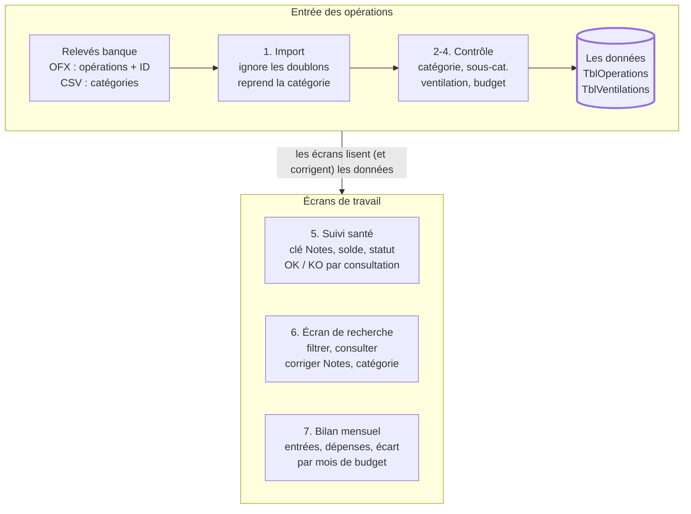

# Suivi Financier – Guide de fonctionnement

Oct 8, 2026 · @Alexandre

Ce guide explique, ce que fait le classeur Excel de suivi des comptes : on importe les relevés de la banque, on range chaque opération dans une catégorie, on suit les remboursements de santé, puis on consulte et corrige depuis un écran de recherche. Il décrit le code de la branche Refonte\_recherche du dépôt Suivi\_Financier, dans son état du 08/10/2026 (dernier commit 0c90a2c).

## En bref : le parcours d'une opération



Une opération entre une seule fois, par l'import, et n'est écrite qu'après votre contrôle ; ensuite, le suivi santé, l'écran de recherche et le bilan travaillent tous sur les deux mêmes tableaux. Les numéros renvoient aux sections de ce guide.

## Les feuilles et tableaux du classeur

Toutes les données vivent dans deux tableaux Excel : **TblOperations** (une ligne par opération bancaire) et **TblVentilations** (les « parts » d'une opération découpée). Les autres feuilles servent soit de réglages, soit d'écrans de saisie.

Un point de vocabulaire utile dès le départ : un **tableau Excel** (ou *ListObject*) est une plage mise en forme avec « Insérer > Tableau ». Le code retrouve toujours ses colonnes par leur **nom d'en-tête**, jamais par leur numéro : on peut donc déplacer une colonne sans rien casser, mais il ne faut **jamais la renommer**.

| Feuille | Tableau / contenu | Rôle pour l'utilisateur | Visible ? |
| --- | --- | --- | --- |
| Accueil | Bouton d'import | Lancer l'import des relevés | Oui |
| Synthese | Critères (année, mois, seuil…) + boutons | Point de départ de toutes les consultations | Oui |
| Import\_data | **TblOperations** | La base : toutes les opérations importées | Oui |
| Ventilations | **TblVentilations** | Les parts des opérations ventilées | Oui |
| Param | **TblCategories** (K:N), **TblDecalagesBudget** (S:V), listes Spécialités, Praticiens, Bénéficiaires, Mois, Années | Réglages modifiables sans toucher au code | Masquée en temps normal |
| frm\_ResolutionCategories | Formulaire | Choisir une catégorie quand le CSV en propose plusieurs | Seulement pendant l'import |
| frm\_ControleCategories | Formulaire | Contrôler catégorie, sous-catégorie, Tiers et Notes | Pendant l'import ou à la demande |
| frm\_NouvelleCategorie | Formulaire | Créer une catégorie ou sous-catégorie | Ouvert depuis le contrôle |
| frm\_Ventilation | Formulaire | Découper une opération en plusieurs parts | À la demande |
| frm\_RapprochementNotes | Formulaire | Retrouver la clé santé d'une opération | Suivi santé |
| frm\_GenerationCle | Formulaire | Créer une nouvelle clé santé | Suivi santé |
| frm\_SuiviSante | Formulaire | Compléter bénéficiaire, franchise, dépassement | Suivi santé |
| frm\_RechercheOperations | **TblRechercheOperations** | Écran central de consultation et de correction | À la demande |
| frm\_Resultat | Zone de résultats | Bilan mensuel, synthèse santé | À la demande |
| TechDernierImport | Liste d'identifiants | Mémorise le dernier import | Très masquée (technique) |

**Pourquoi des « formulaires » en feuilles et pas de vraies fenêtres ?** Les fenêtres VBA classiques (*UserForm*) s'affichaient mal sur un poste à plusieurs écrans (problème d'échelle d'affichage, « DPI »). Chaque formulaire est donc une feuille cachée qui s'affiche le temps de la saisie. Tant qu'elle est ouverte, Excel vous empêche d'aller sur un autre onglet : c'est voulu, cela imite une fenêtre « modale ». On en sort uniquement par ses boutons (Terminer, Valider, Annuler, Sortir…).

## 1. L'import des relevés (OFX + CSV)

L'import ajoute à TblOperations les seules opérations **nouvelles**, avec leur catégorie, et ne réécrit jamais une opération déjà présente. On le lance avec le bouton de la feuille Accueil (macro `ImporterOperationsOFX`, module `mod_ImportOFX`).

**Pourquoi deux fichiers ?** Le fichier **OFX** de la banque contient les opérations avec un identifiant unique (le *FITID*) mais **sans catégorie**. Le fichier **CSV** exporté en même temps contient, lui, la **catégorie** choisie dans l'application de la banque. L'import lit les deux et les « recolle ».

Ce qui se passe, dans l'ordre :

1. **Choix des fichiers.** Excel vous demande d'abord l'OFX, puis le CSV. Annuler l'une des deux fenêtres arrête tout, sans rien modifier.
2. **Lecture de l'OFX.** Chaque opération (balise `STMTTRN`) donne : date comptable, date d'opération, type, Tiers (`NAME`), libellé (`MEMO`, rangé dans la colonne **Notes**), montant (négatif = dépense) et numéro de chèque.
3. **Anti-doublon.** Le FITID devient la colonne **ID\_Transaction**. Si cet identifiant existe déjà dans Import\_data, l'opération est ignorée. On peut donc réimporter un relevé qui chevauche le précédent sans créer de doublon.
4. **Rapprochement avec le CSV.** Pour retrouver la catégorie, le code fabrique une clé « date + montant + Tiers » des deux côtés (le CSV est attendu en UTF-16, séparé par des tabulations, avec les colonnes Date, Libellé, Catégorie, Montant). Trois cas :
   - la clé est trouvée avec une seule catégorie → elle est reprise ;
   - elle n'est pas trouvée → catégorie vide, l'opération sera à ranger à la main ;
   - elle est trouvée avec **plusieurs** catégories différentes (deux achats identiques le même jour) → cas « ambigu ».
5. **Cas ambigus.** S'il y en a, la feuille **frm\_ResolutionCategories** s'affiche : une ligne par cas, une liste déroulante avec les catégories possibles. Vous choisissez, puis « Terminer et appliquer ».
6. **Contrôle des catégories.** Le formulaire de contrôle s'ouvre (voir section 2). C'est ici que chaque opération reçoit sa catégorie **et** sa sous-catégorie. Si vous cliquez sur « Annuler l'import », **rien n'est écrit** : le classeur reste exactement comme avant.
7. **Calculs automatiques.** Pour chaque opération : le mois de budget (section 4) et, pour une dépense de santé, la date et la spécialité de consultation lues dans Notes (section 5).
8. **Écriture.** Les nouvelles lignes sont ajoutées en bas de TblOperations, l'identifiant forcé au format Texte (sinon Excel arrondirait les longs numéros). Puis la sous-catégorie et, si l'opération a été ventilée, sa catégorie d'origine sont écrites, et le tableau est trié par date comptable, la plus récente en haut.
9. **Mémorisation du dernier import.** La liste des identifiants ajoutés est notée dans la feuille technique TechDernierImport. C'est elle qui alimente le bouton « Dernier import ».
10. **Trois questions finales**, toutes facultatives :
    - « Traiter/revoir les catégories des opérations affectées à Santé ? » → lance la vérification des clés santé ;
    - si oui, « Réaliser le rapprochement des opérations de santé ? » → lance le formulaire de suivi santé ;
    - « Afficher les opérations importées ? » → ouvre l'écran de recherche sur le dernier import.
11. **Bilan.** Un message résume : opérations lues, déjà présentes, ajoutées, sans correspondance CSV, ambiguës. Si vous n'avez demandé aucun écran, vous revenez sur Synthese.

Répondre « Non » aux questions santé n'est pas grave : tout peut être relancé plus tard avec le bouton « Traitement des données de santé » de Synthese.

## 2. Le contrôle des catégories

Chaque opération est rangée sur **deux niveaux** : une **Catégorie** (ex. « Santé, prévoyance ») et une **Sous-catégorie** (ex. « Frais, remb santé »). La banque n'en fournit qu'un seul, la « catégorie source » : un tableau de correspondance fait le lien.

### Le tableau de correspondance TblCategories (feuille Param, colonnes K à N)

| Colonne | Contenu | Exemple |
| --- | --- | --- |
| K – CategorieSource | Le texte exact envoyé par la banque (ne pas modifier) | Frais, remb santé |
| L – Categorie | La catégorie de rangement | Santé, prévoyance |
| M – SousCategorie | La sous-catégorie (peut rester vide) | Frais, remb santé |
| N – Verifie | « Oui » quand vous avez contrôlé la ligne | Oui |

Quand une opération arrive avec la catégorie source « X », le formulaire lui propose automatiquement la Catégorie et la Sous-catégorie de la ligne « X ». Les listes déroulantes de tout le classeur sont alimentées par ce tableau.

### Le formulaire frm\_ControleCategories

Au début, une question : **« Les catégories ont-elles été correctement renseignées dans la source ? »**

- **Oui** → les propositions sont gardées telles quelles. Seules les opérations **sans** correspondance (catégorie source vide ou inconnue) vous sont présentées, car on ne saurait pas où les ranger.
- **Non** → toutes les opérations vous sont présentées, une par une.
- **Annuler** → l'import s'arrête, rien n'est écrit.

Pour chaque opération affichée, vous voyez la date, le montant, le Tiers, le libellé/Notes et la catégorie source, puis :

- **Catégorie** puis **Sous-catégorie** (listes déroulantes ; la seconde se met à jour selon la première) ;
- **Tiers** et **Notes** modifiables, pour corriger un libellé bancaire peu lisible. Exception : pour une opération en « Frais, remb santé », ces deux champs sont **grisés et verrouillés**, parce que Notes contient la clé de consultation utilisée par le suivi santé (section 5) ;
- les boutons **< Précédent** / **Suivant >** pour naviguer ;
- **+ Nouvelle catégorie** pour créer une catégorie absente (voir ci-dessous) ;
- **Ventiler...** pour découper l'opération (section 3) ;
- **Terminer et continuer** pour valider l'ensemble ; **Annuler l'import** pour tout abandonner.

Vos choix ne sont pris en compte qu'au clic sur « Terminer et continuer ». Deux garde-fous à ce moment :

- s'il reste des opérations **sans catégorie**, impossible de terminer. Le message propose **OK** (aller à la première opération à corriger) ou **Annuler** (rester où vous êtes) ;
- si certaines opérations n'ont **jamais été affichées**, le message demande confirmation : elles garderont la catégorie proposée.

### Créer une catégorie (frm\_NouvelleCategorie)

Le bouton « + Nouvelle catégorie » ouvre un petit formulaire par-dessus le contrôle. Vous choisissez une catégorie existante ou en tapez une nouvelle, puis la sous-catégorie. À la validation, la paire est ajoutée à TblCategories et vous revenez au contrôle avec la nouvelle valeur déjà sélectionnée.

Un **garde-fou orthographique** évite les quasi-doublons : si ce que vous tapez ressemble à une valeur existante à 2 lettres près (ex. « Alimentaton » pour « Alimentation »), le formulaire vous le signale avant de créer. La comparaison ignore aussi les accents, les majuscules et les espaces en trop.

### Corriger plus tard

Depuis l'écran de recherche (section 6), un **double-clic sur une cellule Categorie ou SousCategorie** rouvre ce même formulaire pour cette seule opération, prérempli avec ses valeurs actuelles. La catégorie et la sous-catégorie se modifient toujours ensemble. À la validation, l'opération est mise à jour, les statuts santé sont recalculés sans message, et l'écran se recharge avec le même filtre qu'avant. Une opération ventilée ne se corrige pas ainsi : un message vous renvoie vers la colonne Ventile.

## 3. La ventilation d'une opération

Ventiler, c'est découper **une** opération bancaire en plusieurs **parts**, chacune avec sa propre catégorie. Exemple : un ticket de pharmacie de 45 € dont 30 € de médicaments remboursés (« Frais, remb santé ») et 15 € d'hygiène (autre sous-catégorie).

**Où la déclencher :** bouton « Ventiler... » du contrôle des catégories pendant l'import, ou double-clic sur la colonne **Ventile** de l'écran de recherche (cellule vide = nouvelle ventilation, cellule « Oui » = revoir une ventilation existante).

**Le formulaire frm\_Ventilation** se lit en deux zones :

- **en haut**, l'en-tête de l'opération (date, Tiers, montant à ventiler) et la liste des parts déjà ajoutées (10 au maximum), avec un bouton **Éditer** en face de chacune ;
- **en bas**, une zone de saisie : Catégorie (avec son bouton « + »), Sous-catégorie, Montant, Notes, puis **Ajouter la ligne** ou **Effacer la saisie**.

Règles à connaître :

1. Le montant d'une part se saisit **toujours en positif**. Le signe (dépense ou entrée) est repris de l'opération d'origine au moment de l'enregistrement.
2. **Éditer** retire immédiatement la part de la liste et la recharge dans la zone de saisie. Si vous ne cliquez pas ensuite sur « Ajouter la ligne », la part reste supprimée : c'est aujourd'hui le seul moyen de supprimer une part.
3. **Terminer** n'est accepté que si la somme des parts est **exactement égale** au montant de l'opération (au centime près). Sinon un message indique l'écart.
4. **Annuler** abandonne la saisie en cours sans rien enregistrer.
5. **Supprimer cette ventilation** (visible seulement si elle existait déjà) efface toutes ses parts et rend à l'opération sa catégorie d'avant la ventilation.

**Ce que cela change dans les données :**

- l'opération d'origine reste dans TblOperations avec la catégorie **« Ventilé »** ; sa catégorie précédente est gardée dans les colonnes CategorieAvantVentilation / SousCategorieAvantVentilation ;
- chaque part devient une ligne de **TblVentilations**, reliée à l'opération par le même ID\_Transaction. Elle porte aussi toutes les colonnes du suivi santé : une part « Frais, remb santé » est suivie exactement comme une opération normale.

**Attention :** rouvrir une ventilation et cliquer sur Terminer réécrit toutes ses parts. Si l'une d'elles avait déjà été rapprochée dans le suivi santé, ce rapprochement est perdu et sera à refaire (un avertissement s'affiche avant une suppression).

## 4. Le mois de budget et les décalages

Chaque opération est rattachée à un **mois de budget** (colonnes Budget, MoisBudget, AnneeBudget), qui est par défaut le mois de sa date comptable. C'est ce mois que lisent le bilan mensuel et le filtre « Opérations du mois ».

Certaines opérations doivent compter pour un autre mois. Exemple typique : le salaire versé le 28 septembre sert à vivre en octobre, on le décale donc de +1 mois. Deux moyens existent.

**1. Une règle générale – tableau TblDecalagesBudget (feuille Param, colonnes S à V)**

| Tiers | Categorie | SousCategorie | Decalage |
| --- | --- | --- | --- |
| DRFIP OCCITANIE ET HTE | Revenus | Salaire/Revenus d'activite | 1 |

- Une case **laissée vide** veut dire « n'importe quelle valeur » (un joker).
- Le décalage est un nombre entier de mois : 1, -1, 2…
- La comparaison ignore les majuscules. Si plusieurs lignes conviennent, c'est **la première du tableau** qui s'applique : placez les règles les plus précises en haut.
- La règle s'applique **aux prochains imports**. Elle ne recalcule pas les opérations déjà présentes.

On peut remplir ce tableau à la main, ou depuis l'écran de recherche : sélectionner une ligne, puis bouton **« Ajouter un décalage »** (il reprend le Tiers, la catégorie et la sous-catégorie de la ligne et demande le nombre de mois).

**2. Une seule opération – bouton « Décaler cette opération »** (écran de recherche)

Il recalcule le mois de budget de la ligne sélectionnée uniquement, entre -24 et +24 mois, et note la valeur dans la colonne **DecalageManuel**. Cette colonne sert de marque : un choix manuel doit toujours primer sur les règles générales.

## 5. Le suivi santé

Le suivi santé vérifie, pour chaque consultation payée, que la Sécurité sociale et la mutuelle ont bien remboursé ce qu'elles devaient. Il ne concerne que les opérations dont la **Sous-catégorie** vaut **« Frais, remb santé »**, qu'elles soient dans TblOperations ou dans TblVentilations.

### L'idée clé : la « clé Notes »

Pour relier une dépense à ses remboursements, toutes les lignes d'une même consultation portent **exactement le même texte** dans la colonne Notes, au format :

`aaaammjj;spécialité;bénéficiaire;montant`

Exemple : `20260915;Généraliste;Alexandre;30`. On saisit normalement ce texte dans l'application de la banque, qui le renvoie dans l'OFX. À l'import, le code lit la date (1er morceau) et la spécialité (2e morceau) pour remplir **Date\_consult** et **Spe\_Consult**. Une spécialité absente de la liste « Specialites » (Param) est rangée dans CommentaireSante au lieu de Spe\_Consult.

Si la date ne peut pas être lue (Notes vide ou mal écrit), Date\_consult reçoit la valeur **02/01/1900**. C'est une « sentinelle » : une fausse date volontaire qui signifie « clé à réparer ».

Un **groupe** = toutes les lignes qui partagent la même clé Notes :

| Date | Tiers | Montant (€) | Notes | Rôle |
| --- | --- | --- | --- | --- |
| 15/09/2026 | DR MARTIN | -30,00 | 20260915;Généraliste;Alexandre;30 | Dépense |
| 22/09/2026 | CPAM | 20,00 | 20260915;Généraliste;Alexandre;30 | Remboursement 1 |
| 25/09/2026 | MUTUELLE | 9,00 | 20260915;Généraliste;Alexandre;30 | Remboursement 2 |

*(Valeurs fictives, pour l'illustration.)*

### Le calcul : solde et statut

Pour chaque groupe, le module `mod_SuiviSante` calcule :

```latex
\text{SoldeSante} = \text{dépenses} - \text{remboursements} - \text{Franchise}
```

Dans l'exemple, avec une franchise de 1 € : 30 − (20 + 9) − 1 = 0. Un solde nul (à un demi-centime près) donne **StatutSante = OK**, sinon **KO**. Le statut est écrit sur toutes les lignes du groupe, le solde sur la ligne de dépense. Un groupe sans dépense (remboursement « orphelin ») reste KO.

Un groupe n'est **plus jamais recalculé** quand sa dépense est OK, ou KO avec « Dépassement d'honoraires = Oui » (on accepte alors qu'il reste un reste à charge). Cela évite de reposer les mêmes questions à chaque import.

### Les trois étapes, dans l'ordre

On les lance après l'import (questions finales) ou à tout moment avec le bouton **« Traitement des données de santé »** de Synthese (macro `RetraiterSuiviSante`).

1. **Réparer les clés manquantes** (`VerifierNotesSante`). Chaque ligne santé dont Date\_consult vaut la sentinelle vous est présentée dans **frm\_RapprochementNotes**. Vous retrouvez la bonne clé parmi celles déjà connues, avec des filtres en cascade : Date (la plus récente d'abord) → Spécialité → Bénéficiaire → Montant. Trois boutons :
   - **Valider** : la clé est écrite dans Notes, et Date\_consult, Spe\_Consult, Bénéficiaire sont remplis aussitôt. La ligne ne sera plus reproposée ;
   - **Pas de correspondance** : ouvre **frm\_GenerationCle** pour créer une clé neuve (date, spécialité, bénéficiaire, montant, boutons « + » pour enrichir les listes), puis Générer et Valider ;
   - **Passer** : rien n'est modifié, la ligne reviendra au prochain lancement.
2. **Calculer** (`CalculerSuiviSante`) : solde et statut de tous les groupes, comme décrit plus haut.
3. **Compléter les cas non soldés** (`TraiterCasSuiviSante`). Chaque dépense KO, sans dépassement déclaré, s'affiche dans **frm\_SuiviSante** avec ses remboursements (2 au plus) et le solde actuel. Vous renseignez :
   - le **Bénéficiaire** (obligatoire) ;
   - le **Tiers corrigé**, obligatoire seulement si le Tiers importé n'est pas dans la liste « Praticiens » (le champ est alors jaune). Pour une part ventilée, la correction s'écrit sur l'opération d'origine ;
   - la **Franchise** retenue (0 si aucune) : le solde se recalcule sous vos yeux ;
   - **Dépassement d'honoraires ?** Oui/Non ;
   - un **Commentaire** libre.

   « Valider ce cas » enregistre, relance le calcul et passe au suivant ; « Cas suivant » passe sans rien changer.

**Cas particulier :** une clé dont la spécialité vaut « non reprise historique » passe directement en OK. Elle sert à neutraliser les anciennes opérations qu'on ne veut pas rapprocher.

### Consulter et corriger : l'écran « Suivi santé »

Le bouton de suivi santé de Synthese (macro `Synthese_Care`) ouvre l'écran de recherche (section 6) avec le préfiltre **SuiviSante**. Il remplace l'ancien écran frm\_Resultat, qui ne trouvait plus aucune ligne depuis le passage aux deux niveaux de catégorie.

Ce qui s'affiche :

- toutes les lignes en sous-catégorie **« Frais, remb santé »** ;
- **et** toutes les lignes de catégorie **« Santé, prévoyance »**, quelle que soit leur sous-catégorie. C'est ce qui permet de repérer une dépense de santé rangée dans la mauvaise sous-catégorie ;
- les parts ventilées concernées, avec la date de l'opération d'origine (au lieu d'une date vide) et leurs propres colonnes santé ;
- les colonnes StatutSante, SoldeSante, Date\_consult et Spe\_Consult, qui restent masquées dans les autres préfiltres.

La ligne au-dessus du tableau résume la situation, par exemple :

« Suivi santé (catégorie Santé, prévoyance) -- 7 ligne(s) dont 1 part(s) ventilée(s) : 3 OK, 2 KO -- écart cumulé des dépenses KO : 45,00 €. »

Comment la lire :

- les lignes « Santé, prévoyance » d'une autre sous-catégorie n'ont pas de statut santé. Elles ne comptent ni en OK ni en KO : ici, 7 − 3 − 2 = 2 lignes sont à vérifier ;
- l'écart cumulé additionne le SoldeSante des seules **dépenses** KO. Le solde n'étant écrit que sur la ligne de dépense d'un groupe, il n'est jamais compté deux fois ;
- le montant d'une ligne KO est en **gras** : rouge pour une dépense, vert pour un remboursement (la règle « positif = vert » est conservée).

**Corriger une sous-catégorie depuis cet écran** :

1. Repérez la ligne mal rangée (par exemple « Santé, prévoyance » avec une sous-catégorie autre que « Frais, remb santé », et sans statut).
2. Double-cliquez sur sa cellule **Categorie** ou **SousCategorie** : le formulaire de contrôle des catégories s'ouvre pour cette seule opération.
3. Choisissez la bonne catégorie et la bonne sous-catégorie, puis « Terminer et continuer ».
4. Les statuts santé sont recalculés sans message et l'écran se recharge, toujours en Suivi santé : la ligne a maintenant son statut OK ou KO.
5. Si sa clé Notes n'a pas encore été vérifiée, lancez ensuite « Traitement des données de santé » pour la rapprocher.

Une part ventilée ne se corrige pas par double-clic sur Categorie : on passe par la colonne Ventile (section 3).

## 6. L'écran de recherche des opérations

**frm\_RechercheOperations** est l'écran central : il affiche les opérations de TblOperations **et** les parts de TblVentilations dans un seul tableau, filtrable avec les flèches natives d'Excel, et permet de corriger sans ouvrir Import\_data.

### Comment l'ouvrir : six entrées, six « préfiltres »

| Bouton (feuille) | Préfiltre | Ce qui s'affiche |
| --- | --- | --- |
| Recherche globale (Synthese ou l'écran lui-même) | aucun | Toutes les opérations et toutes les parts |
| Dernier import (Synthese, ou question en fin d'import) | DernierImport | Les opérations ajoutées par le dernier import |
| Opérations du mois (Synthese) | OperationsDuMois | Le mois de budget choisi sur Synthese, au-dessus du seuil de montant |
| Suivi santé (Synthese, macro Synthese\_Care) | SuiviSante | Les lignes « Frais, remb santé » et toutes celles de catégorie « Santé, prévoyance », parts ventilées comprises, avec leurs colonnes santé (détail en section 5) |
| Erreurs santé (Synthese) | ErreursSante | Les lignes dont Date\_consult vaut la sentinelle 02/01/1900 |
| Voir le détail des entrées / dépenses (bilan mensuel) | DetailTotal | Les entrées (ou les dépenses) du mois du bilan |

Une ligne de texte au-dessus du tableau rappelle le filtre actif et le nombre de lignes. Les montants suivent la règle de couleur commune du classeur : vert pour une entrée d'argent, noir pour une dépense, gras pour une ligne « en alerte » (rouge si c'est une dépense). Sont en alerte les plus grosses dépenses en « Opérations du mois » (leur nombre se règle sur Synthese) et les lignes KO en « Suivi santé ». Si vous aviez posé un filtre de colonne, il est remis à l'identique après chaque rechargement.

### Les colonnes

| Colonne | Signification | Modifiable ? |
| --- | --- | --- |
| Valider | Tapez « Oui » pour marquer une ligne à enregistrer | Oui |
| Date, Tiers, Montant | Données de l'opération | Non |
| Categorie, SousCategorie | Rangement | Par double-clic sur Categorie ou SousCategorie |
| Notes | Libellé ou clé santé | Oui, sauf une clé santé déjà valide (cellule grisée) |
| Ventile | « Oui » sur une part de ventilation | Par double-clic |
| Budget, StatutSante, SoldeSante, Date\_consult, Spe\_Consult | Informations calculées | Non |

Les colonnes techniques (identifiant, source O/V, numéro de ligne de ventilation) sont masquées. Une opération ventilée se retrouve donc de deux façons : par sa ligne d'origine (catégorie « Ventilé ») ou par chacune de ses parts (Ventile = Oui).

### Les actions

- **Corriger des Notes en lot** : modifiez les cellules Notes, mettez « Oui » dans Valider, puis cliquez sur **« Appliquer les lignes marquées »**. Les Notes sont écrites dans la bonne table, la marque « Oui » est effacée, puis la vérification et le calcul santé sont relancés.
- **Double-clic sur Categorie ou SousCategorie** : ouvre le formulaire de contrôle des catégories pour cette seule opération, prérempli avec ses valeurs actuelles. À la validation, l'enregistrement est immédiat (sans passer par Valider), les statuts santé sont recalculés sans message et l'écran se recharge avec le même préfiltre. Sur une opération ventilée, un message vous renvoie vers la colonne Ventile.
- **Double-clic sur Ventile** : démarre ou revoit une ventilation (section 3).
- **Ajouter un décalage** / **Décaler cette opération** : voir section 4.
- **Sortir** : referme l'écran et revient sur Synthese.

Modifier directement une cellule Date, Tiers ou Montant de cet écran ne change **rien** dans les données : c'est un affichage, reconstruit à chaque recherche.

## 7. La feuille Synthese et les écrans de résultat

La feuille **Synthese** est le tableau de bord : vous y choisissez une période et des réglages, puis un bouton.

| Cellule nommée | Sens | Utilisée par |
| --- | --- | --- |
| critAnnee | Année de budget | Bilan mensuel, Opérations du mois, Détail des totaux |
| critMois | Mois de budget | Idem |
| critNbLigne | Nombre de grosses dépenses à surligner | Écran de recherche |
| critValMin | Seuil de montant (en valeur absolue : -300 compte comme 300) | Opérations du mois, Détail des totaux |
| critTriChamp, critTri | Champ et ordre de tri | Plus utilisés : on trie avec les flèches de filtre |

**Bilan mensuel** (`Budget_Bilan_Mensuel`) : calcule, pour le mois de budget choisi, le total des entrées, le total des dépenses et la différence. Le résultat s'affiche dans la feuille frm\_Resultat, avec deux boutons « Voir le détail des entrées » et « Voir le détail des dépenses » qui ouvrent l'écran de recherche. Ce bilan ne lit que TblOperations : une opération ventilée compte une fois, pour son montant total.

**Suivi santé** (`Synthese_Care`) : ouvre l'écran de recherche avec le préfiltre « Suivi santé », décrit en section 5. L'ancienne synthèse affichée dans frm\_Resultat a été abandonnée le 07/10/2026.

Tous ces écrans masquent Synthese pendant leur affichage ; le bouton **Sortir** la réaffiche.

## Glossaire

| Terme | Définition |
| --- | --- |
| OFX | Format de fichier bancaire standard ; donne les opérations et leur identifiant, pas la catégorie. |
| FITID / ID\_Transaction | Identifiant unique d'une opération donné par la banque ; sert d'anti-doublon et relie une opération à ses parts ventilées. |
| Catégorie source | La catégorie telle que la banque l'envoie dans le CSV. |
| Catégorie / Sous-catégorie | Le rangement à deux niveaux utilisé dans le classeur. |
| Ventilation / part | Découpage d'une opération en plusieurs montants de catégories différentes ; chaque morceau est une part (TblVentilations). |
| « Ventilé » | Catégorie technique donnée à l'opération d'origine une fois ventilée. |
| Mois de budget | Le mois auquel une opération est comptabilisée (souvent celui de la date comptable, parfois décalé). |
| Clé Notes | Texte `aaaammjj;spécialité;bénéficiaire;montant` partagé par une dépense de santé et ses remboursements. |
| Sentinelle (02/01/1900) | Fausse date volontaire dans Date\_consult qui signale une clé santé illisible. |
| Groupe santé | Ensemble des lignes partageant la même clé Notes. |
| StatutSante | OK si le groupe est soldé, KO sinon. |
| SoldeSante | Dépenses − remboursements − franchise, sur la ligne de dépense. |
| Franchise | Part retenue par l'assurance, saisie par vous ; jamais calculée par le code. |
| Dépassement d'honoraires | « Oui » = le reste à charge est accepté, le groupe n'est plus reproposé. |
| Formulaire-feuille | Feuille cachée qui sert de fenêtre de saisie et bloque la navigation tant qu'elle est ouverte. |
| Préfiltre | Le critère avec lequel l'écran de recherche est chargé (dernier import, mois, erreurs santé…). |

## Points relevés à la lecture du code

Ces constats sont apparus en rédigeant le guide. **Aucun n'a été corrigé** : ils sont listés pour décision.

1. **Synthèse santé vide — traité le 07-08/10/2026.** `Synthese_Care` ouvre désormais l'écran de recherche en préfiltre SuiviSante, qui teste la sous-catégorie et inclut les parts ventilées (section 5).
2. **Constantes encore dupliquées.** `NOM_FEUILLE_RAPPROCHEMENT`, `NOM_FEUILLE_GENERATION`, `NOM_FEUILLE_RESOLUTION` et `NOM_FEUILLE_SUIVI_SANTE` sont déclarées à la fois dans mod\_VarGlobales et dans leur module d'installation. `VEN_FEUILLE` / `VEN_TABLE` sont aussi recopiées dans mod\_SuiviSante et mod\_RechercheOperations.
3. **Libellés santé encore codés en dur.** mod\_ImportOFX, mod\_ControleCategories et maintenant mod\_RechercheOperations utilisent les constantes `SOUS_CATEGORIE_SANTE` et `CATEGORIE_SANTE`. Les modules mod\_SuiviSante (1 endroit), mod\_FormulairesNotes (4), mod\_SuiviSanteFormulaire (5), mod\_Ventilation (1) et mod\_Categories (1, plus `CategorieSanteNouvelle()` qui double `CATEGORIE_SANTE`) reconstruisent encore ces textes chacun de leur côté.
4. **Deux points de la liste de suivi semblent déjà traités dans le code**, à confirmer par un test :
   - « Montant des parts toujours positif » : mod\_Ventilation écrit désormais le montant avec le signe de l'opération d'origine (ajout du 01/10) ;
   - « Ventiler une nouvelle opération depuis la recherche » : un double-clic sur une cellule Ventile vide démarre maintenant une ventilation.
5. **Nettoyage à prévoir après la mise en production.** Plusieurs en-têtes de modules (dont mod\_SuiviSanteFormulaire et mod\_FormulairesNotes) décrivent encore un fichier « 100 % ASCII » ou un suivi santé lancé automatiquement à chaque import. Le type `mod_Rapports.TOperation` n'est plus utilisé depuis la refonte de Synthese\_Care.
6. **Règles de décalage non rétroactives.** Une règle ajoutée dans TblDecalagesBudget ne s'applique qu'aux imports suivants ; il n'existe pas de bouton pour recalculer le budget des opérations déjà présentes. C'est peut-être voulu, mais c'est à savoir.
